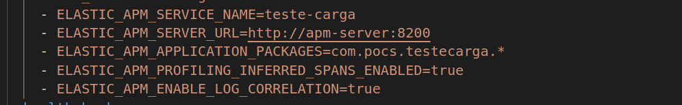

# APM (Application Performance Monitoring): #
É a ferramenta da Elastic que ajuda a observar os serviços, baseando-se nos 3 pilares da Observabiidade (Log, Metrica e Trace)

Objetivo dessa POC foi montar a stack da Elastic necessária para usarmos o APM, focando unicamente no Trace nesse primeiro momento, para isso, foram desenvolvidos 3 serviços Java para realizar os testes.


# API de Teste: #
- Inicializando a Stack:
```
docker-compose up -d
```
- Para testar o uso:

```
URL: http://localhost:8000/gerador/nome-time/<codigo-time>
method: GET
<codigo-time>: de 1 a 4 para teste de sucesso
<codigo-time>: acima de 4 para teste de erro
```
- Para testes de carga:

    - Neste caso é gerado um loop infinito fazendo chamadas aleatórias a API de gerado de nomes de time, simulando erros e sucessos.

```
URL: http://localhost:8004/test/carga/async
method: POST
```

- Acessar o Kibana:

```
http://localhost:5601/
```

- Acessar o APM:


# Dependências: #

 - Java 11
 - Spring 2.4.2
 - Gradle
 - Docker

# Resultados da POC #

Foi muito simples configurar os serviços Java para serem monitorados pelo APM, a documentação encontrada no Kibana é simples e facil de imlementar.

Sendo necessario apenas alguns ajustes mostrado abaixo:

- Dockerfile: Download do Agent e execução do mesmo.


- docker-compose: Configuração das variaveis de ambiente, caso for testar com Kubernets é só adicionar as variaveis de ambiente.



# Testes Futuros #

- Adicionar um serviço em NodeJs entre os serviços Java
- Adicionar um serviço em Golang entre os serviços Java
- Verificar usando mensageria (Kafka, RabbitMQ ou Redis Stream)
- Enviar os Logs usando filebeat
- Enviar as métricas usando o metricbeat

# Referências: #
 - [Introdução sobre APM](https://www.youtube.com/watch?v=5Ylg_08HFqw&t=5s)
 - [Elastic APM](https://www.elastic.co/pt/observability)
